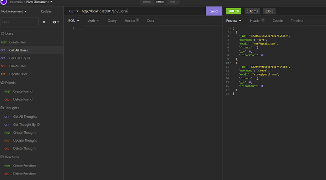

# Social-Network-API

## Description

This is meant to depict the backend of a social media database using Mongoose and Insomnia!

## Features

You are able to create, view, delete, and edit users as well as add friends from other users. You can also
post and delete thoughts and then have friends (other users) create reactions to those thoughts.

## Links

<a href="https://vilas-izquierdo.github.io/Social-Network-API/">Deployed Page</a>

<a href="https://github.com/vilas-izquierdo/Social-Network-API">GitHub</a>

<a href="https://www.youtube.com/watch?v=DOza1cJeTes">Demo Video</a>
